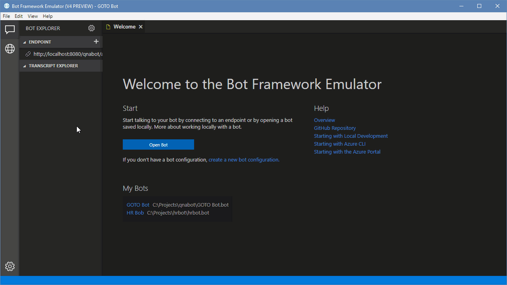

# QnA Bot
This repository contains sample code for my session "Build a FAQ bot with 
deeplearning4J" Feel free to clone this repository and modify the code.

## Quickstart
Before you can use the code, please follow these steps to set everything up.

 1. Clone the repository `https://github.com/Microsoft/botbuilder-java` to disk
 2. Open a terminal and navigate to the repository
 3. Run the command `mvn install` to install the botbuilder SDK for Java
 4. Clone the repository `https://github.com/wmeints/qna-bot` to disk
 5. Using your terminal, navigate to the repository `qna-bot`
 6. Run `mvn clean compile` to check if the code compiles

## Train the model
This project relies on a FAQ model that you need to train first.
Follow these steps to train the model:

 1. Edit the questions and answers file in `./data` you can refer to answers by the unique index for the answer.
 2. Package the training application by running `mvn package`
 3. Execute the training application with `java -jar training/target/training-1.0-SNAPSHOT.jar`
 
**Please be aware** The process of training a model may take a lot of time, depending on your machine. 
Also note that you need CUDA 9 and a CUDA capable graphics card.

## Deploy the code
This code runs on top of tomcat 9. You need to install Tomcat on your computer
first. You can get a copy over at https://tomcat.apache.org/download-90.cgi.

Follow these steps to deploy the application:

 1. Run `mvn package` in the `service` project folder to package the project as a WAR file.
 2. Copy the war file from `target/` to the `webapps` folder in the tomcat install folder.
 3. Start tomcat with `bin/catalina.sh run` or `bin/catalina.bat start` if you work on Windows.
 
The app should now be available under `http://localhost:8080/qnabot`
 
Configure the Microsoft Bot Emulator to point to `http://localhost:8080/qnabot/api/messages` for the bot endpoint.
You can leave the appId and password setting empty.